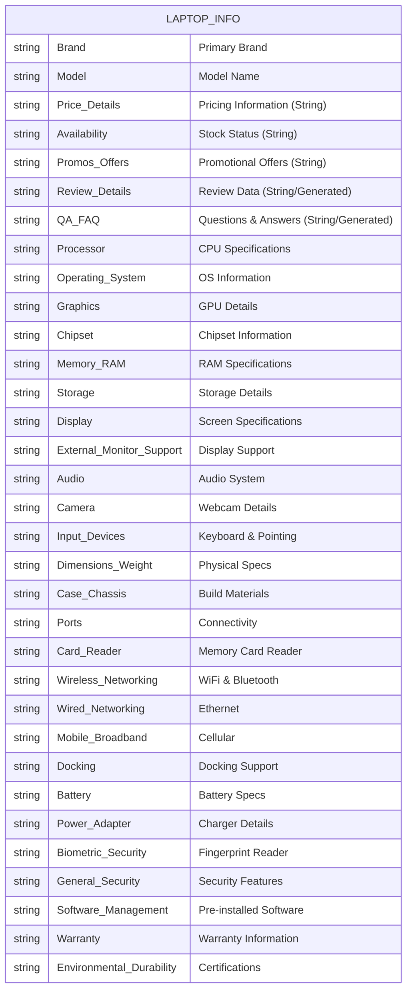
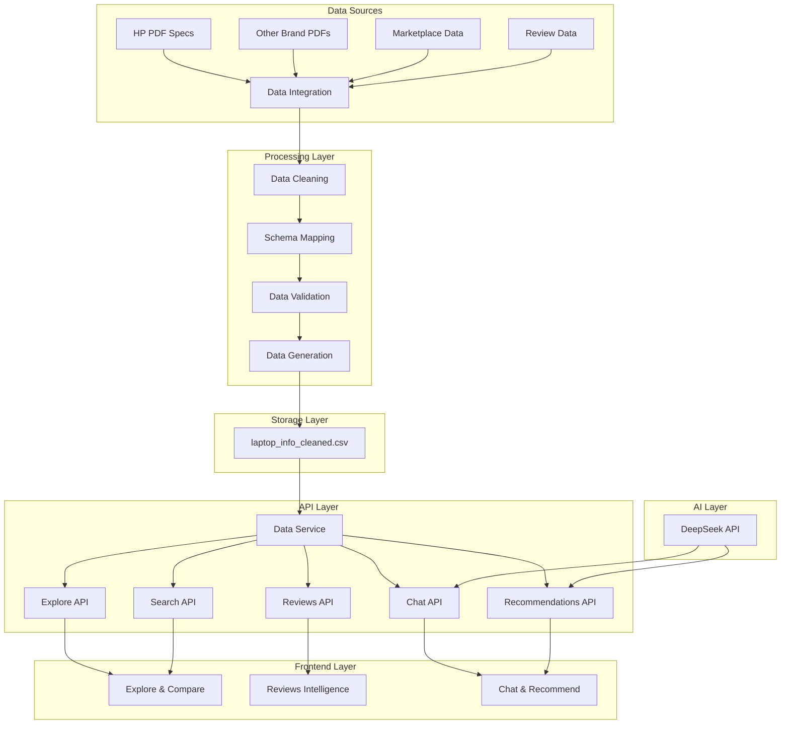
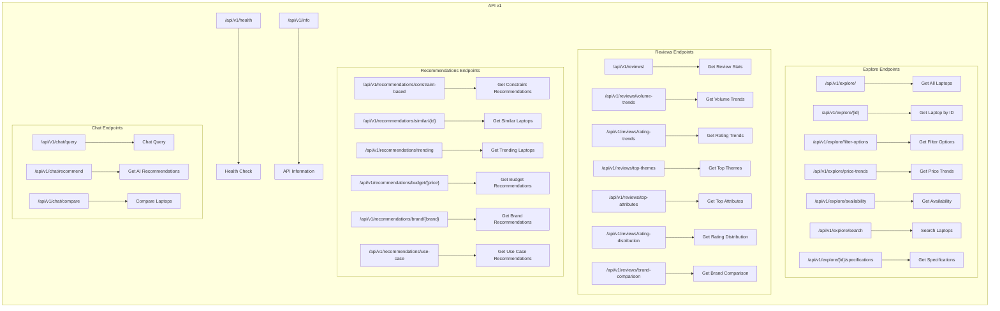
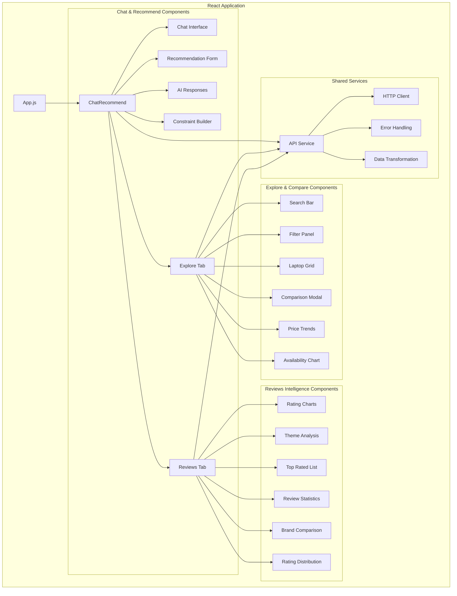
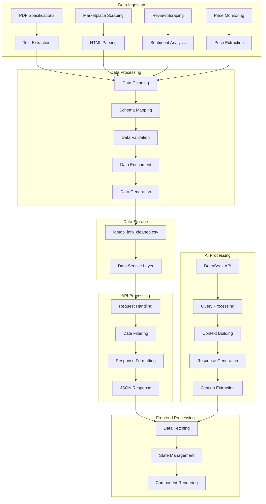
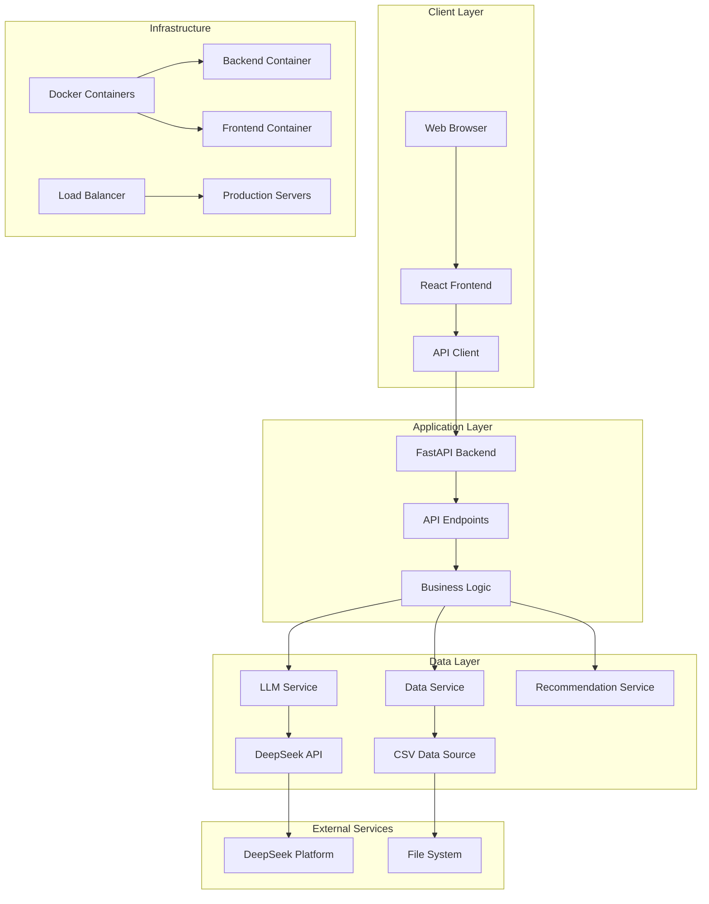

# Schema Diagram

## Dataset Architecture

## Data Flow Architecture

## API Endpoint Structure

## Frontend Component Structure

## Data Processing Pipeline

## System Architecture Overview

This schema diagram provides a comprehensive overview of the Laptop Assistant platform architecture, including:

1. **Dataset Structure**: Entity-relationship diagram showing the main data fields
2. **Data Flow**: How data moves from sources to the frontend
3. **API Structure**: Complete endpoint hierarchy with correct paths
4. **Frontend Components**: React component organization with tabbed interface
5. **Processing Pipeline**: Data transformation workflow including generation
6. **System Architecture**: Overall system design with FastAPI backend

The diagrams use Mermaid syntax and can be rendered in GitHub, GitLab, or other Markdown viewers that support Mermaid diagrams.

